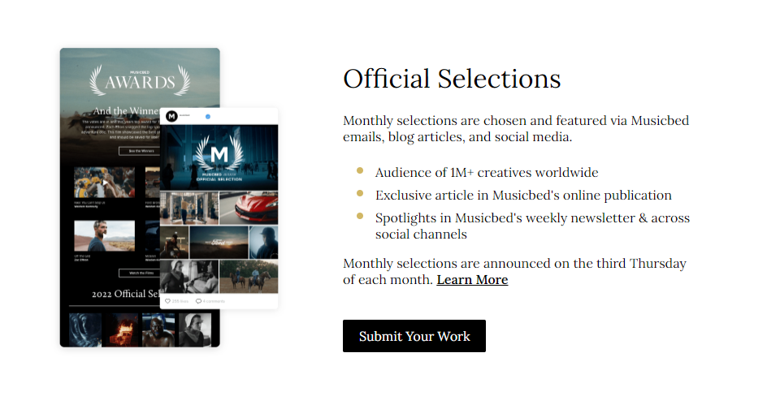

# Option 1: Build Flex Section from Mockup

Use the following screenshot and specifications listed below to build a 2 column section for a website:

1. Download the background image from: https://drive.google.com/file/d/1RMMp7RrSUyU2Hp8MWjQQATcoaIqVB_qR/view?usp=sharing
2. The 2-column section should be centered horizontally on the page with a min-height of 450px and a max-width of 800px
3. Link to and use the free Google font "Lora" for all text: https://fonts.google.com/specimen/Lora (you will need the 400 and 600 weights)
4. The button should have a hover effect where it grows (hint: transform: scale(1.05))
5. Do your best to guess colors, font-sizes, margins, and padding. Your build should match the mockup as closely as possible
6. Send a copy of your compressed/zipped project folder to jeremyhutchings99@gmail.com
7. Be prepared to present your webpage and code with the class

# Option 2: Build a 2 COLUMN FLEXBOX Section from an Existing Website

1. Find a well-known/popular website
2. Build a 2 column section to match the website as closely as possible
3. Send a copy of your compressed/zipped project folder to jeremyhutchings99@gmail.com ALONG with a screenshot of the section you copied from the website
4. Be prepared to present your webpage and code with the class

# Option 3: Build 2 COLUMN FLEXBOX Section from Your Own Idea

1. Browse other websites getting ideas of what a 2 column section might look like
2. Build your own custom 2 column flexbox section
3. Send a copy of your compressed/zipped project folder to jeremyhutchings99@gmail.com
4. Be prepared to present your webpage and code with the class

BONUS POINTS for any option if you incorporate "flex-direction: column" as well as row
