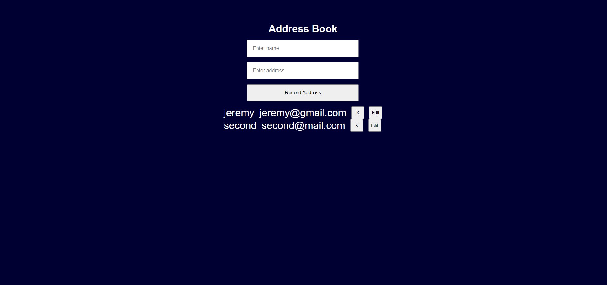

# Address Book

Use the following screenshot and specifications listed below to build a address book:

1. The user should be able to input a name and email address in fields and it should then be added to a list of addresses
2. The submit button shouldn't be enabled/shown unless all the info is filled out
3. The list of addresses added should be displayed somewhere
4. The user should be able to delete any address after it has been added
5. You can style it however you'd like as long as it's clean and easy to use
6. Send a copy of your compressed/zipped project folder to jeremyhutchings99@gmail.com

If you have time:

- See if you can figure out how to make it so the user can edit an address after it has been added
