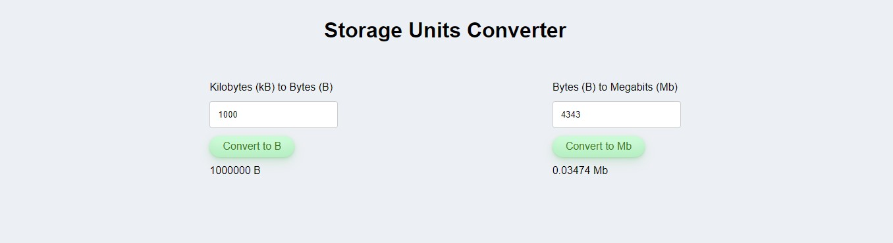

# Computer Storage Units Converter

Use the following screenshot and specifications listed below to build a simple conversion calculator for a website:

1. The user should be able to convert kilobytes (kB) to bytes (B)
2. The user should be able to convert bytes (B) to megabits (Mb)
3. You will need to look up the conversion formulas for the two above
4. When the user clicks the "convert" button for either of the conversions the answer should display near that area, include units in the answer
5. When the input is not valid (not long enough or not a number), the convert button should be hidden
6. You can style it however you'd like as long as it's clean and easy to use
7. Send a copy of your compressed/zipped project folder to jeremyhutchings99@gmail.com

If you have time:

- Display an error message if the input is not a number
- Round any the Mb conversion to 5 decimal places
- Add other conversions that would be useful to you
