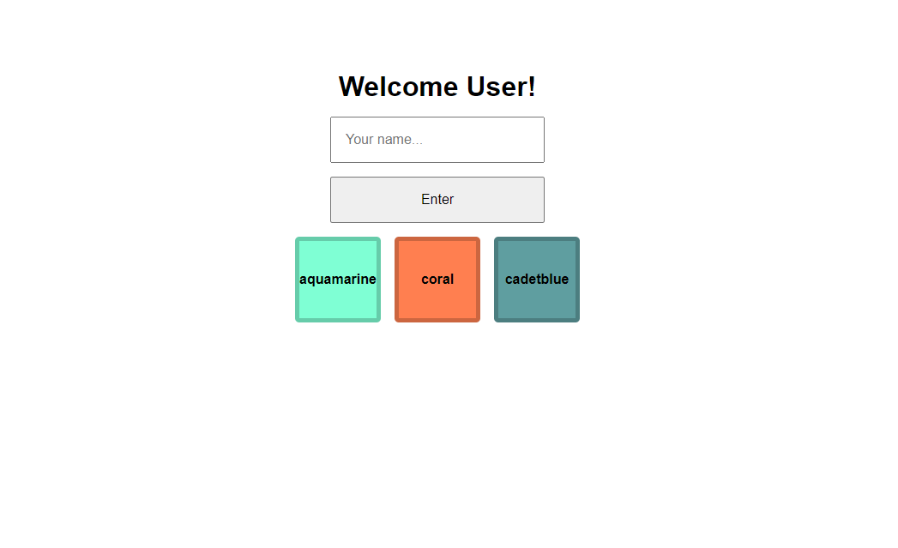

# Simple Vue App

Use the following screenshot and specifications listed below to build a simple Vue app:

1. Make a welcome message that is able to change. Hint: {{ ... }} and a data property

2. Create a text input that the user can enter their name in. Hint: v-model and a data property

3. When the user submits their name (you'll need a submit button to go along with the input), the welcome message should update with their name in it. Hint: v-on:click and a function

4. Create a list of colors (at least 3) and display each one on the page. Hint: v-for and a new data array

5. When the user clicks one of those colors, the background color of an area of page should change to that color. Hint: v-on:click and v-bind:style="backgroundColor: something"

6. You can style it however you'd like as long as it's clean and easy to use

7. Send a copy of your compressed/zipped project folder to jeremyhutchings99@gmail.com

If you have time:

- Add a feature that would use a v-if && v-else
- Add more input fields that do something (maybe the user can input their own color instead of choosing one that already exists)
