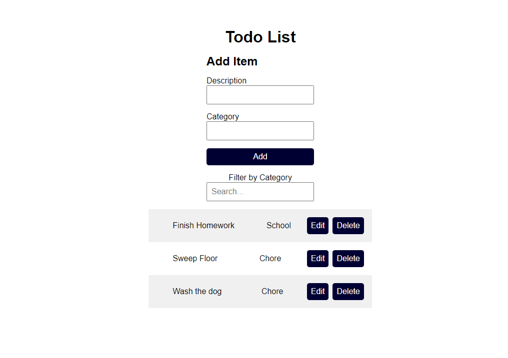

# To-Do List App

Use the following screenshot and specifications listed below to build a simple to-do list app:

1. Create a simple form that adds an to-do item to a list. The minimum fields are item description and item category.

2. The interface should display the list of to-do items in an easy-to-read structure.

3. There should be a button that allows the user to delete an item.

4. There should be a button that allows the user to update/edit an item. Use a modal or another distinct area to edit the item. (Think back to editing our expenses example)

To get more complicated / if you have time:

5. Users should be able to search based on the description.

6. Users should be able to sort/filter based on the category.

7. Use conditional styling + coloring to show different categories.

8. Research JavaScript date formats and add a "due date" field for each item.

- You can style it however you'd like as long as it's clean and easy to use.
- Send a copy of your compressed/zipped project folder to jeremyhutchings99@gmail.com OR upload it to GitHub and send a link.
