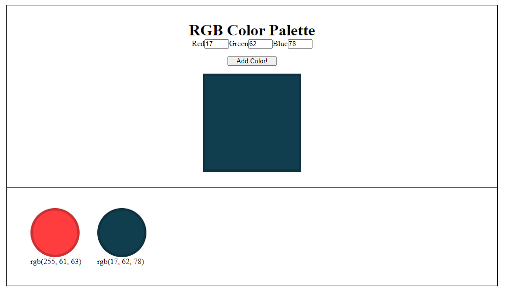

# Color Palette Creator App

Use the following screenshot and instructions listed below to help build a color palette app:



1. Create the HTML. You will need:

   - Separate inputs for the red, green, and blue number values. There should be a max number allowed of 255 and a min of 0
   - A button that adds the color to the palette list data property
   - An element that displays a color based on the current values of the number inputs
   - A palette display area that loops through the current items in the palette

2. Add stylesheet + styles

3. Create the Vue app. You will need to bind the inputs to red, green, and blue color data properties using v-model. You can create a data property such as:

```json
    newColor: {
        red: '',
        green: '',
        blue: ''
    }
```

4. Create a computed property that turns the user input color values into a string to show the color in the display area. Ex: rgbString = "rgb(RED, GREEN, BLUE)" where red, green, and blue get inserted based on the newColor data property.

5. Apply that computed property string to the background color CSS of your color display area. Ex: v-bind:style="{backgroundColor: rgbString}"

6. Add a click function to the button that adds the new color rgbString to a list of all the colors. Hint: you can use the computed property that's already being created.

7. Loop through that list of colors in the palette display area. Make the color or background the rgbString color.

   - Display the rbgString as text next to each item so the user can see what the values are

8. Send a copy of your compressed/zipped project folder to jeremyhutchings99@gmail.com

To get more complicated / if you have time:

8. Research how to convert RGB to a hex code and display the hex code as well.
9. Allow the user to find the inverted color of an item in the color palette. inverted = (255 - red value, 255 - green value, 255 - blue value)
10. Same as 9 but for complementary colors.

- You can style it however you'd like as long as it's clean and easy to use.
