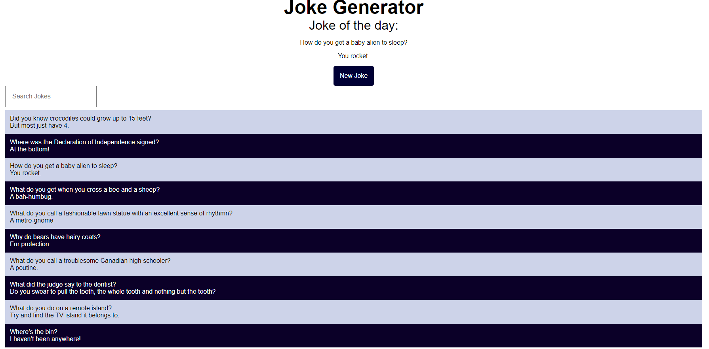

# Jokes App

Use the following screenshot and specifications listed below to help build a jokes app:

1. When Vue loads, fetch a random list (make a GET request) from the joke API at "https://official-joke-api.appspot.com/jokes/ten" - it will return 10 jokes to you. You need to turn these into JSON format since they'll come to you as a string. (fetch().then()...)

2. As soon as you have the list, display one of those jokes on the screen (you can randomly select one by index)

3. If the user clicks on a "new joke" button, the currently displayed joke should update with a new one

4. Create a search input that would allow the user to search through the entire list of jokes. Display the results back to the user (a computed property works great for this)

To get more complicated / if you have time:

6. Allow the user to input their own jokes using input fields

- You can style it however you'd like as long as it's clean and easy to use.
- Upload your project to GitHub and send a link or add me as a collaborator (jhutchings99).
